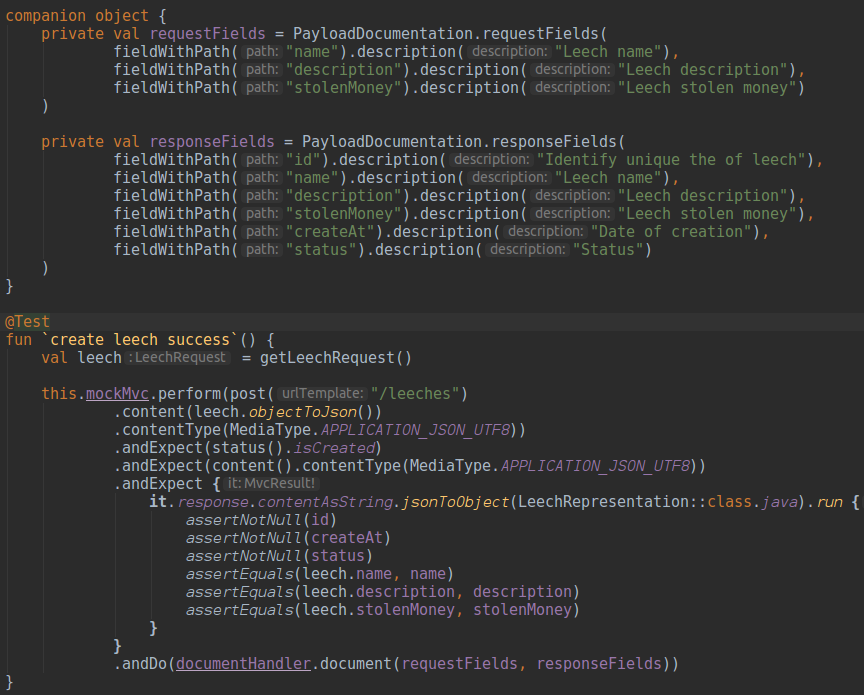
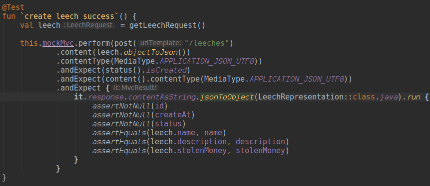
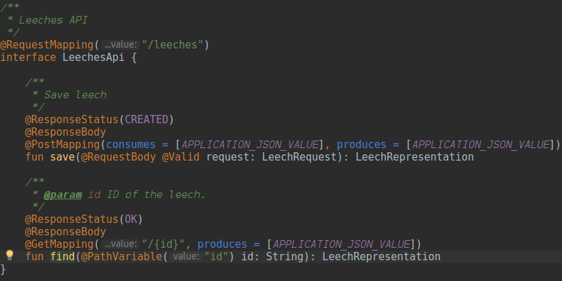
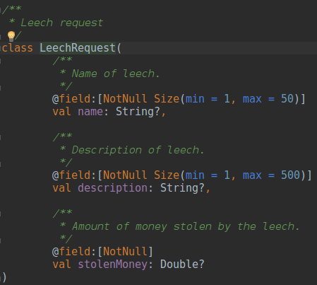

# Auto Rest Docs para Kotlin

[](https://travis-ci.org/danilopaiva/auto-restdocs-kotlin)
[](https://codecov.io/gh/danilopaiva/auto-restdocs-kotlin)

## Spring REST Docs

[Spring REST Docs](https://docs.spring.io/spring-restdocs/docs/current/reference/html5/) ajuda documentar serviços RESTful a partir dos testes unitários.

## Spring Auto REST Docs

O [Spring Auto REST Docs](https://htmlpreview.github.io/?https://github.com/ScaCap/spring-auto-restdocs/blob/v2.0.1/docs/index.html) é uma extensão do Spring REST Docs e ajuda escrever ainda menos códido e documentação.

* No Spring REST Docs é necessário adicionar documentação do JSON a uma DSL.
* No Spring Auto REST Docs a documentação dos POJOs são geradas a partir do Javadoc.

No entanto foi necessário utilizar o [Dokka](https://kotlinlang.org/docs/reference/kotlin-doc.html) para gerar o Javadoc do Kotlin.

## Dokka

[Dokka](https://kotlinlang.org/docs/reference/kotlin-doc.html) é uma engine de documentação para Kotlin que dá suporte a comentários em KDoc e Javadoc.

## Exemplos

### Spring REST Docs

No exemplo abaixo é ilustrado como ficaria uma classe de teste utilizando somente o Spring REST Docs:



### Spring Auto REST Docs
 
Neste exemplo abaixo é ilustrado como ficaria uma classe de teste utilizando o Spring REST Docs + Spring Auto REST Docs:



API com comentários em Kdoc:



Exemplo de um POJO com Kdoc:



## Gerando a documentação

Primeiramente é necessário buildar a aplicação com o comando abaixo:

```bash
mvn clean install
```

Em caso de sucesso será gerado o arquivo [index.html](auto-restdocs-kotlin/leeches-web/target/generated-docs/index.html) em auto-restdocs-kotlin/leeches-web/target/generated-docs/.
